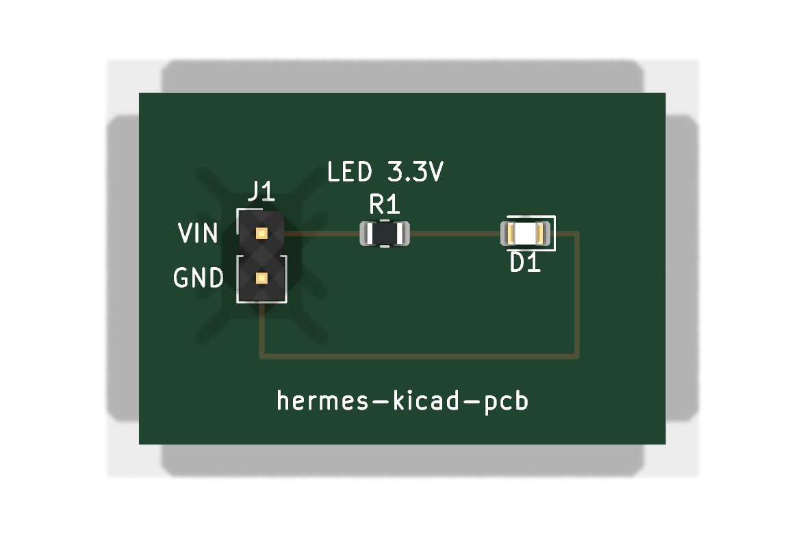
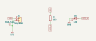
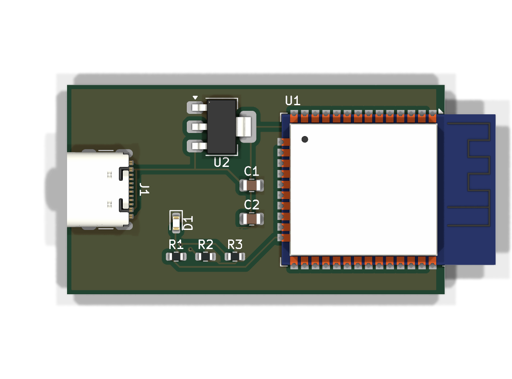
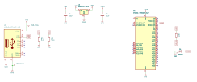
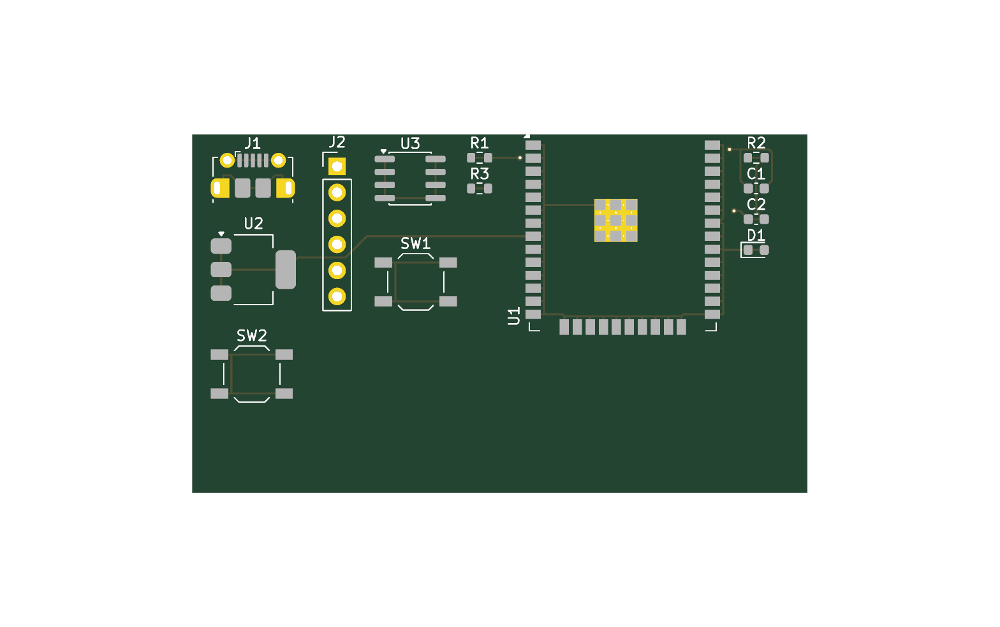

# kicad-pcb — KiCad PCB automation for Hermes Agent

[](https://skills.sh/pantojinho/hermes-kicad-pcb)
[](https://github.com/pantojinho/hermes-kicad-pcb/actions/workflows/ci.yml)

Headless PCB design skill for **Linux, Windows and macOS**: native schematics,
scripted placement, optional Freerouting autorouting (DSN/SES), DRC/ERC reporting,
gerber/drill/BOM export and **EasyEDA / EasyEDA Pro import**. It is an optional KiCad
automation path, not a reproduction of the GPT-6 Astra workflow. Validated end-to-end on Linux and Windows 11; macOS via runtime
resolvers + CI smoke. Every tool and path is resolved at runtime (env var > known
location > PATH), so the same commands run on any OS.

## Install

```bash
# Hermes
hermes skills install pantojinho/hermes-kicad-pcb/kicad-pcb

# Any agent (Claude Code, Codex, Cursor, ...)
npx skills add pantojinho/hermes-kicad-pcb
```

> **Hermes security scan**: the Hermes skills scanner may flag this skill as
> CAUTION (reads of `os.environ` + `subprocess` calls — inherent to a skill that
> orchestrates kicad-cli/Freerouting/pcbnew; the optional LCSC lookup uses network access; no `shell=True`,
> no dynamic commands). Review with `hermes skills inspect
> pantojinho/hermes-kicad-pcb/kicad-pcb` and install with `--force` if you agree.

## Requirements

| Component | Linux | Windows | macOS |
|---|---|---|---|
| KiCad 10+ (`kicad-cli` + pcbnew bindings) | distro package / PPA | installer (bundled python + bindings) | app bundle |
| [Freerouting](https://github.com/freerouting/freerouting) | `linux-x64.zip` bundle | `windows-x64.msi` | `macos-*.dmg` |
| System Java | **not needed** (bundles embed their own runtime) | idem | idem |
| `easyeda2kicad` (optional, LCSC parts) | `pipx install easyeda2kicad` | idem | idem |

> The plain `freerouting-*.jar` is a fallback and requires **Java 25+** (the 2.4.1
> jar is compiled for class file 69 — Java 17 fails with `UnsupportedClassVersionError`).
> Prefer the bundle; unzip it to `~/Work/tools/` (auto-detected) or point
> `FREEROUTING_EXE` / `FREEROUTING_JAR` at it.

Quick check on any OS:

```bash
python skills/kicad-pcb/scripts/check_env.py        # report + how to fix what's missing
```

## Quick start

```bash
# smallest end-to-end board — needs ONLY KiCad 10 (no Freerouting, no Java):
# schematic + board + ERC + DRC/parity + gerbers zip + 3D render (exit 0 = PASS)
python skills/kicad-pcb/scripts/simple_board.py --out ./led-board

# reference pipeline: board -> DSN -> Freerouting -> SES -> DRC (exit 0 = PASS)
python skills/kicad-pcb/scripts/demo_autoroute.py --out /tmp/pcb-demo

# full example (ESP32 + LED + USB-C): schematic + board + autoroute + renders
python skills/kicad-pcb/scripts/esp32_example.py --out /tmp/esp32

# import an EasyEDA Pro PCB into KiCad (headless)
python skills/kicad-pcb/scripts/easyeda_bridge.py import-pro project.epro --out out/

# LCSC part -> KiCad symbol + footprint + 3D (needs easyeda2kicad)
python skills/kicad-pcb/scripts/easyeda_bridge.py lcsc C2040 --out out/lib

# isolated demo stages
python skills/kicad-pcb/scripts/demo_autoroute.py --stage create   # board + DSN
python skills/kicad-pcb/scripts/demo_autoroute.py --stage route    # autoroute
python skills/kicad-pcb/scripts/demo_autoroute.py --stage import   # imports SES
python skills/kicad-pcb/scripts/demo_autoroute.py --stage drc      # DRC only

# flags: --route-timeout 600 --max-passes 50 --threads 4
# exit codes: 0 ok | 2 environment | 3 stage failed | 4 DRC FAIL
```

On Windows/macOS the pipeline scripts re-exec themselves on KiCad's bundled Python
when `import pcbnew` is unavailable in the current interpreter — nothing to configure.

Optional env overrides: `KICAD_PYTHON`, `KICAD_CLI`,
`KICAD10_FOOTPRINT_DIR`/`KICAD_FOOTPRINT_DIR`, `FREEROUTING_EXE`, `FREEROUTING_JAR`.

## What's inside

| File | Purpose |
|---|---|
| `skills/kicad-pcb/SKILL.md` | Reviewed-design workflow + headless pipelines + 18 pitfalls |
| `skills/kicad-pcb/references/api-cheatsheet.md` | Verified pcbnew Python calls (KiCad 10.0.6) + Freerouting bundle-first guide |
| `skills/kicad-pcb/references/jlcpcb-rules.md` | JLCPCB fab/assembly rules + PCBA BOM/CPL upload workflow |
| `skills/kicad-pcb/scripts/kicad_paths.py` | Cross-platform tool resolvers (env > known paths > PATH) |
| `skills/kicad-pcb/scripts/simple_board.py` | KiCad-only LED board: schematic + board + ERC/DRC/parity + fab zip + renders |
| `skills/kicad-pcb/scripts/sch_gen.py` | Readable KiCad 10 schematics from Python + cropped SVG export (used by both examples) |
| `skills/kicad-pcb/scripts/demo_autoroute.py` | One-shot pipeline: board → DSN → Freerouting → SES → DRC |
| `skills/kicad-pcb/scripts/esp32_example.py` | Full example: ESP32+LED+USB-C schematic + board + autoroute + renders |
| `skills/kicad-pcb/scripts/easyeda_bridge.py` | EasyEDA Std/Pro PCB import + LCSC parts → KiCad |
| `skills/kicad-pcb/scripts/check_env.py` | Preflight: report what's missing and how to fix it |
| `.github/workflows/ci.yml` | Smoke matrix + full e2e on Linux and Windows (both examples, gated by `.github/scripts/example_gate.py`) |
| `CONTRIBUTING.md` | Ground rules for humans and AI agents who want to improve this skill |

## Example: LED board built autonomously by an AI agent (Windows + Linux)

An AI coding agent (Claude Code) cloned this repo on a stock Windows 11 laptop with
only KiCad 10.0.6 installed (no Freerouting, no Java), ran `simple_board.py` and
produced this board on its own: schematic, placement, routing, ERC 0 / DRC 0 /
unconnected 0 / schematic parity 0, JLCPCB-ready gerber zip and the renders below.
The same command produces the same board on Linux (tested by hand, and rebuilt by
the `linux-e2e` + `windows-e2e` CI jobs on every push).

```bash
python skills/kicad-pcb/scripts/simple_board.py --out led-board --vin 3.3 --led-ma 2
```

3D render | Schematic
---|---
 | 

## Example: ESP32 + LED + USB-C (generated 100% headless, Linux + Windows)

Minimal dev board — ESP32-WROOM-32, USB-C receptacle (5V), AMS1117-3.3 regulator,
LED on GPIO2 + series resistor. Generated end-to-end by `esp32_example.py`:
schematic → board nets taken from the schematic netlist → placement (USB-C mouth
flush with the board edge, antenna past the edge) → Freerouting → GND stitching +
pours → DRC with schematic parity → renders. Same result on Linux and Windows
(KiCad 10.0.6 + Freerouting 2.4.1); CI rebuilds and gates it on both.

3D render | Schematic
---|---
 | 

DRC: **0 errors, 0 unconnected, 0 schematic-parity items**. Findings that remain
visible on purpose (and are the only ones the CI gate accepts):
- 4× `hole_clearance` (0.194 mm vs 0.25 mm) inside the GCT USB4105 library
  footprint itself — its NPTH alignment pegs next to its own GND pads, per the
  maker's land pattern. Confirm against your fab's NPTH-to-copper limit rather than
  relaxing the rule.
- ERC on U1 EN (pin 3): left open so it stays flagged — a real ESP32 board needs an
  EN RC (10 kΩ pull-up + 1 µF) and usually a BOOT button; this example only
  demonstrates the headless pipeline.

The antenna overhang is handled by a scoped custom rule in the generated
`.kicad_dru` (`A.memberOfFootprint('U1')`, silkscreen only) instead of a global
severity change or editing the library footprint.

## Validated proof: ESP32 dev board (previous full design)

13 components (ESP32-WROOM-32, CH340N, AMS1117-3.3, USB micro-B), 60x35mm 2-layer,
177 tracks — **0 DRC violations, 0 unconnected** (KiCad 10.0.6, Freerouting 2.4.1,
Linux; end-to-end headless).



## EasyEDA import (validated)

Three entry points, all validated end-to-end on Linux (KiCad 10.0.6):
- `import-pro` with a real EasyEDA Pro board (45 footprints, 1068 tracks):
  geometry, nets, zones and outline convert losslessly (DRC: 0 unconnected /
  0 parity; the 498 rule violations are the source project's own design rules).
- `import-std` with EasyEDA Standard JSON: tracks, vias, pads, nets and outline
  convert; copper areas arrive misplaced (canvas-offset) — re-create zones.
- `lcsc C14663`: full library drop (symbol + footprint + 3D wrl/step).

## Companion skills

For design review, BOM/sourcing and manufacturing workflows, pair with
[aklofas/kicad-happy](https://github.com/aklofas/kicad-happy) (MIT) — KiCad
project analysis/DFM scoring, JLCPCB/LCSC/DigiKey BOM management, PCBA upload
translator.

## Contributing

Improvements welcome — humans and AI agents alike. See [CONTRIBUTING.md](CONTRIBUTING.md)
(English-only repo, cross-platform by default, validated claims only).

## Acknowledgments

- [aklofas/kicad-happy](https://github.com/aklofas/kicad-happy) by Andrew Klofas
  (MIT) — JLCPCB fabrication/assembly rules in
  `references/jlcpcb-rules.md` are adapted (paraphrased) from it.
- Freerouting's headless CLI makes the DSN/SES autorouting loop possible.
- KiCad's built-in EasyEDA parsers (via `pcbnew.PCB_IO_MGR`) power the import bridge.

## License

MIT — see [LICENSE](LICENSE).
