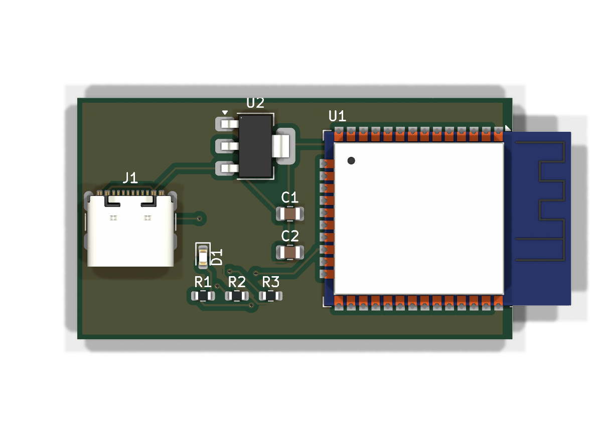
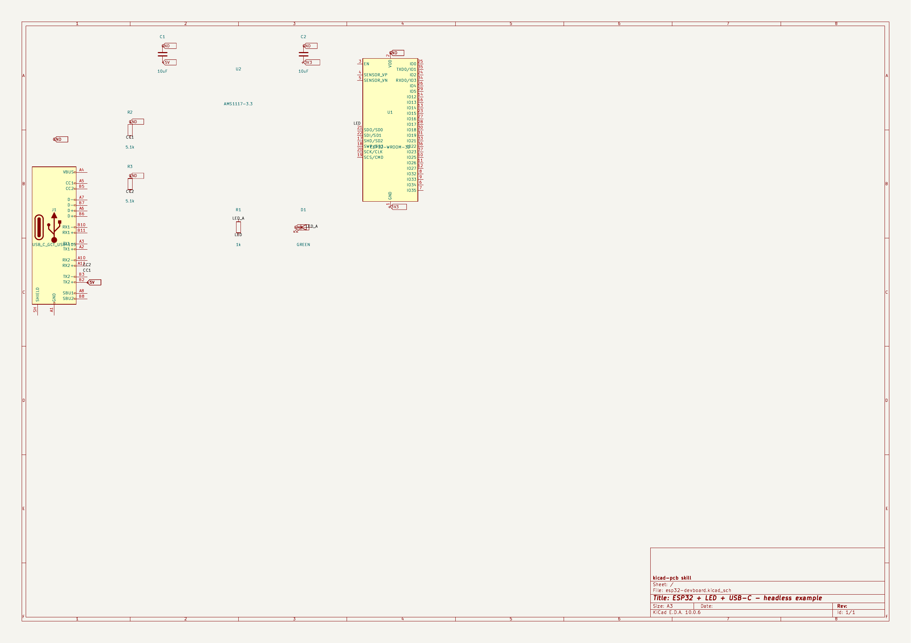

# kicad-pcb — KiCad PCB automation for Hermes Agent

[](https://skills.sh/pantojinho/hermes-kicad-pcb)
[](https://github.com/pantojinho/hermes-kicad-pcb/actions/workflows/ci.yml)

Headless PCB design skill for **Linux, Windows and macOS**: native schematics,
scripted placement, optional Freerouting autorouting (DSN/SES), DRC/ERC reporting,
gerber/drill/BOM export and **EasyEDA / EasyEDA Pro import**. It is an optional KiCad
automation path, not a reproduction of the GPT-6 Astra workflow. Validated end-to-end on Linux; Windows/macOS via runtime
resolvers + CI smoke. Every tool and path is resolved at runtime (env var > known
location > PATH), so the same commands run on any OS.

## Install

```bash
# Hermes
hermes skills install pantojinho/hermes-kicad-pcb/kicad-pcb

# Any agent (Claude Code, Codex, Cursor, ...)
npx skills add pantojinho/hermes-kicad-pcb
```

> **Hermes security scan**: the Hermes skills scanner may flag this skill as
> CAUTION (reads of `os.environ` + `subprocess` calls — inherent to a skill that
> orchestrates kicad-cli/Freerouting/pcbnew; the optional LCSC lookup uses network access; no `shell=True`,
> no dynamic commands). Review with `hermes skills inspect
> pantojinho/hermes-kicad-pcb/kicad-pcb` and install with `--force` if you agree.

## Requirements

| Component | Linux | Windows | macOS |
|---|---|---|---|
| KiCad 10+ (`kicad-cli` + pcbnew bindings) | distro package / PPA | installer (bundled python + bindings) | app bundle |
| [Freerouting](https://github.com/freerouting/freerouting) | `linux-x64.zip` bundle | `windows-x64.msi` | `macos-*.dmg` |
| System Java | **not needed** (bundles embed their own runtime) | idem | idem |
| `easyeda2kicad` (optional, LCSC parts) | `pipx install easyeda2kicad` | idem | idem |

> The plain `freerouting-*.jar` is a fallback and requires **Java 25+** (the 2.4.1
> jar is compiled for class file 69 — Java 17 fails with `UnsupportedClassVersionError`).
> Prefer the bundle; unzip it to `~/Work/tools/` (auto-detected) or point
> `FREEROUTING_EXE` / `FREEROUTING_JAR` at it.

Quick check on any OS:

```bash
python skills/kicad-pcb/scripts/check_env.py        # report + how to fix what's missing
```

## Quick start

```bash
# reference pipeline: board -> DSN -> Freerouting -> SES -> DRC (exit 0 = PASS)
python skills/kicad-pcb/scripts/demo_autoroute.py --out /tmp/pcb-demo

# full example (ESP32 + LED + USB-C): schematic + board + autoroute + renders
python skills/kicad-pcb/scripts/esp32_example.py --out /tmp/esp32

# import an EasyEDA Pro PCB into KiCad (headless)
python skills/kicad-pcb/scripts/easyeda_bridge.py import-pro project.epro --out out/

# LCSC part -> KiCad symbol + footprint + 3D (needs easyeda2kicad)
python skills/kicad-pcb/scripts/easyeda_bridge.py lcsc C2040 --out out/lib

# isolated demo stages
python skills/kicad-pcb/scripts/demo_autoroute.py --stage create   # board + DSN
python skills/kicad-pcb/scripts/demo_autoroute.py --stage route    # autoroute
python skills/kicad-pcb/scripts/demo_autoroute.py --stage import   # imports SES
python skills/kicad-pcb/scripts/demo_autoroute.py --stage drc      # DRC only

# flags: --route-timeout 600 --max-passes 50 --threads 4
# exit codes: 0 ok | 2 environment | 3 stage failed | 4 DRC FAIL
```

On Windows/macOS the pipeline scripts re-exec themselves on KiCad's bundled Python
when `import pcbnew` is unavailable in the current interpreter — nothing to configure.

Optional env overrides: `KICAD_PYTHON`, `KICAD_CLI`,
`KICAD10_FOOTPRINT_DIR`/`KICAD_FOOTPRINT_DIR`, `FREEROUTING_EXE`, `FREEROUTING_JAR`.

## What's inside

| File | Purpose |
|---|---|
| `skills/kicad-pcb/SKILL.md` | Reviewed-design workflow + headless pipelines + 15 pitfalls |
| `skills/kicad-pcb/references/api-cheatsheet.md` | Verified pcbnew Python calls (KiCad 10.0.6) + Freerouting bundle-first guide |
| `skills/kicad-pcb/references/jlcpcb-rules.md` | JLCPCB fab/assembly rules + PCBA BOM/CPL upload workflow |
| `skills/kicad-pcb/scripts/kicad_paths.py` | Cross-platform tool resolvers (env > known paths > PATH) |
| `skills/kicad-pcb/scripts/demo_autoroute.py` | One-shot pipeline: board → DSN → Freerouting → SES → DRC |
| `skills/kicad-pcb/scripts/esp32_example.py` | Full example: ESP32+LED+USB-C schematic + board + autoroute + renders |
| `skills/kicad-pcb/scripts/easyeda_bridge.py` | EasyEDA Std/Pro PCB import + LCSC parts → KiCad |
| `skills/kicad-pcb/scripts/check_env.py` | Preflight: report what's missing and how to fix it |
| `.github/workflows/ci.yml` | Smoke matrix: ubuntu + windows (syntax + frontmatter + preflight) |
| `CONTRIBUTING.md` | Ground rules for humans and AI agents who want to improve this skill |

## Example: ESP32 + LED + USB-C (generated 100% headless)

Minimal dev board — ESP32-WROOM-32, USB-C receptacle (5V), AMS1117-3.3 regulator,
LED + series resistor. Generated end-to-end by `esp32_example.py`: schematic,
placement, autorouting, DRC, then exported renders.

3D render (Linux) | Schematic (Linux)
---|---
 | 

Windows renders are generated by CI on every push (`artifacts` in the Actions tab):
[example-3d-windows.png](assets/example-3d-windows.png) ·
[example-schematic-windows.png](assets/example-schematic-windows.png).

## Validated proof: ESP32 dev board (previous full design)

13 components (ESP32-WROOM-32, CH340N, AMS1117-3.3, USB micro-B), 60x35mm 2-layer,
177 tracks — **0 DRC violations, 0 unconnected** (KiCad 10.0.6, Freerouting 2.4.1,
Linux; end-to-end headless).


## EasyEDA import (validated)

Three entry points, all validated end-to-end on Linux (KiCad 10.0.6):
- `import-pro` with a real EasyEDA Pro board (45 footprints, 1068 tracks):
  geometry, nets, zones and outline convert losslessly (DRC: 0 unconnected /
  0 parity; the 498 rule violations are the source project's own design rules).
- `import-std` with EasyEDA Standard JSON: tracks, vias, pads, nets and outline
  convert; copper areas arrive misplaced (canvas-offset) — re-create zones.
- `lcsc C14663`: full library drop (symbol + footprint + 3D wrl/step).

## Companion skills

For design review, BOM/sourcing and manufacturing workflows, pair with
[aklofas/kicad-happy](https://github.com/aklofas/kicad-happy) (MIT) — KiCad
project analysis/DFM scoring, JLCPCB/LCSC/DigiKey BOM management, PCBA upload
translator.

## Contributing

Improvements welcome — humans and AI agents alike. See [CONTRIBUTING.md](CONTRIBUTING.md)
(English-only repo, cross-platform by default, validated claims only).

## Acknowledgments

- [aklofas/kicad-happy](https://github.com/aklofas/kicad-happy) by Andrew Klofas
  (MIT) — JLCPCB fabrication/assembly rules in
  `references/jlcpcb-rules.md` are adapted (paraphrased) from it.
- Freerouting's headless CLI makes the DSN/SES autorouting loop possible.
- KiCad's built-in EasyEDA parsers (via `pcbnew.PCB_IO_MGR`) power the import bridge.

## License

MIT — see [LICENSE](LICENSE).
